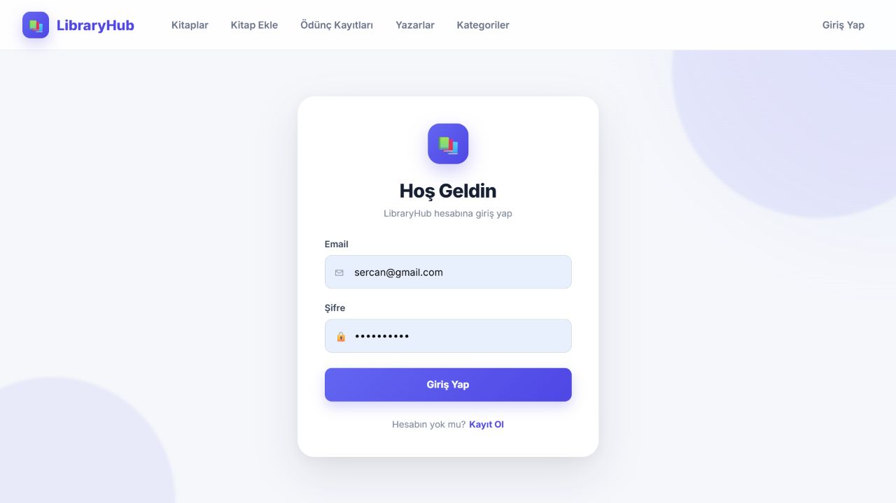
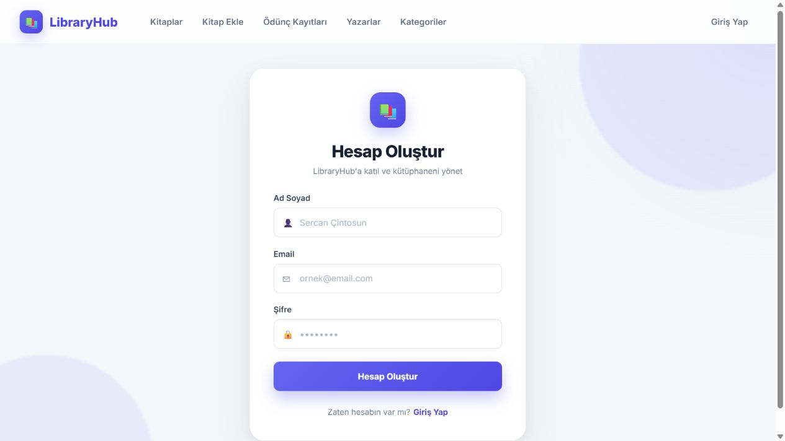

# LibraryHub


LibraryHub; kitap, yazar, kategori, üye ve ödünç kayıtlarını yönetmek için geliştirilmiş tam yığın bir kütüphane uygulamasıdır. Proje, katmanlı mimariye sahip bir ASP.NET Core Web API ile React tabanlı bir kullanıcı arayüzünü aynı depoda bir araya getirir.

## Canlı uygulama

[LibraryHub uygulamasını aç](https://library-api-pink.vercel.app)

## Ekran görüntüleri

### Giriş



### Kayıt



## Özellikler

- Üye kaydı ve giriş işlemleri
- JWT tabanlı kimlik doğrulama
- `Member` ve `Admin` rol desteği
- Kitap, yazar ve kategori yönetimi
- Kitap ödünç alma ve iade işlemleri
- Üyeye ait ödünç kayıtlarını listeleme
- Aynı kitabın eş zamanlı olarak birden fazla üyeye verilmesini engelleme
- Üyenin mevcut kitabı iade etmeden yeni kitap almasını engelleme
- FluentValidation ile istek doğrulama
- Merkezi hata yakalama middleware'i
- Swagger/OpenAPI dokümantasyonu
- Docker ile dağıtım desteği

## Kullanılan teknolojiler

### Backend

- ASP.NET Core Web API 8
- Entity Framework Core 8
- Microsoft SQL Server / Azure SQL
- JWT Bearer Authentication
- BCrypt.Net
- FluentValidation
- Swagger / OpenAPI

### Frontend

- React 19
- TypeScript
- Vite
- React Router
- Axios

### Dağıtım

- Frontend: Vercel
- Backend: Render (Docker)
- Veritabanı: Azure SQL Database

## Mimari

Backend dört ana katmandan oluşur:

```text
Library.WebApi/          HTTP endpoint'leri, middleware ve uygulama başlangıcı
LibraryApi.Business/     Servisler, DTO'lar, doğrulama ve iş kuralları
LibraryApi.DataAccess/   EF Core DbContext, repository'ler ve migration'lar
LibraryApi.Entities/     Veritabanı varlıkları
library-frontend/        React + TypeScript kullanıcı arayüzü
```

Temel veri modeli:

```text
Author ──< Book >── Category
             │
             v
            Loan >── Member
```

## API uçları

Kayıt ve giriş dışındaki uçlar JWT erişim anahtarı gerektirir. İsteklerde aşağıdaki başlık kullanılmalıdır:

```http
Authorization: Bearer <token>
```

| Metot | Uç | Açıklama | Yetki |
|---|---|---|---|
| `POST` | `/api/Members/register` | Yeni üye oluşturur | Herkese açık |
| `POST` | `/api/Members/login` | Giriş yapar ve JWT üretir | Herkese açık |
| `GET` | `/api/Members/me` | Oturum açan üyeyi getirir | Üye |
| `PUT` | `/api/Members/{id}` | Üye bilgilerini günceller | Üye / Admin |
| `GET` | `/api/Books` | Kitapları listeler | Üye |
| `GET` | `/api/Books/{id}` | Kitap detayını getirir | Üye |
| `POST` | `/api/Books` | Kitap ekler | Üye |
| `PUT` | `/api/Books/{id}` | Kitabı günceller | Üye |
| `DELETE` | `/api/Books/{id}` | Kitabı siler | Admin |
| `GET` | `/api/Authors` | Yazarları listeler | Üye |
| `POST` | `/api/Authors` | Yazar ekler | Üye |
| `PUT` | `/api/Authors?id={id}` | Yazarı günceller | Üye |
| `DELETE` | `/api/Authors/{id}` | Yazarı siler | Admin |
| `GET` | `/api/Categories` | Kategorileri listeler | Üye |
| `POST` | `/api/Categories` | Kategori ekler | Üye |
| `PUT` | `/api/Categories/{id}` | Kategoriyi günceller | Üye |
| `DELETE` | `/api/Categories/{id}` | Kategoriyi siler | Admin |
| `GET` | `/api/Loans` | Yetkiye göre ödünç kayıtlarını listeler | Üye |
| `POST` | `/api/Loans` | Yeni ödünç kaydı oluşturur | Üye |
| `PUT` | `/api/Loans/{id}/return` | Kitabı iade eder | Üye / Admin |

Tüm istek ve yanıt şemaları için Swagger arayüzünü kullanabilirsiniz.

## Yerel kurulum

### Gereksinimler

- [.NET 8 SDK](https://dotnet.microsoft.com/download/dotnet/8.0)
- [Node.js](https://nodejs.org/) 20 veya üzeri
- SQL Server, SQL Server Express veya erişilebilir bir Azure SQL veritabanı
- İsteğe bağlı: Docker

### 1. Depoyu klonlayın

```bash
git clone https://github.com/sercancintosunn/LibraryApi.git
cd LibraryApi
```

### 2. Backend ortam değişkenlerini ayarlayın

Uygulama, .NET yapılandırma adlandırmasını kullanır. Gerçek parolaları ve JWT anahtarlarını kaynak koda eklemeyin.

PowerShell örneği:

```powershell
$env:ConnectionStrings__DefaultConnection="Server=localhost;Database=LibraryDb;Trusted_Connection=True;TrustServerCertificate=True"
$env:JwtSettings__SecretKey="en-az-32-karakterlik-guclu-bir-gizli-anahtar"
$env:JwtSettings__Issuer="LibraryApi"
$env:JwtSettings__Audience="LibraryApiUsers"
```

SQL kullanıcı adı ve parolasıyla bağlantı örneği:

```text
Server=tcp:<sunucu>.database.windows.net,1433;Initial Catalog=<veritabani>;User ID=<kullanici>;Password=<parola>;Encrypt=True;TrustServerCertificate=False;Connection Timeout=30;
```

### 3. Veritabanını oluşturun

```bash
dotnet tool install --global dotnet-ef --version 8.0.29
dotnet ef database update --project LibraryApi.DataAccess --startup-project Library.WebApi
```

`dotnet-ef` daha önce kurulduysa ilk komutu çalıştırmanız gerekmez.

### 4. Backend'i çalıştırın

```bash
dotnet restore
dotnet run --project Library.WebApi
```

Backend varsayılan olarak `http://localhost:5127` adresinde, Swagger ise `http://localhost:5127/swagger` adresinde açılır.

### 5. Frontend'i çalıştırın

`library-frontend` klasöründe `.env.local` dosyası oluşturun:

```env
VITE_API_URL=http://localhost:5127/api
```

Ardından:

```bash
cd library-frontend
npm install
npm run dev
```

Frontend varsayılan olarak `http://localhost:5173` adresinde açılır.

## Docker ile çalıştırma

İmajı oluşturun:

```bash
docker build -t library-api .
```

Konteyneri başlatın:

```bash
docker run --rm -p 8080:8080 \
  -e ConnectionStrings__DefaultConnection="<connection-string>" \
  -e JwtSettings__SecretKey="<guclu-gizli-anahtar>" \
  -e JwtSettings__Issuer="LibraryApi" \
  -e JwtSettings__Audience="LibraryApiUsers" \
  library-api
```

API, `http://localhost:8080` adresinden erişilebilir olur.

## Üretim ortamı değişkenleri

### Backend

| Değişken | Açıklama |
|---|---|
| `ConnectionStrings__DefaultConnection` | SQL Server bağlantı dizesi |
| `JwtSettings__SecretKey` | JWT imzalama anahtarı |
| `JwtSettings__Issuer` | Token üreticisi |
| `JwtSettings__Audience` | Token hedef kitlesi |
| `PORT` | Hosting sağlayıcısının atadığı HTTP portu |

`JwtSettings__SecretKey` artık depodaki `appsettings.json` içinde bulunmaz. En az 32 baytlık,
rastgele üretilmiş bir değeri Render ortam değişkeni olarak tanımlayın. Depoda önceden
bulunan anahtar herkese açık olduğu için canlı ortamda kullanılmamalıdır. Canlı anahtarı
değiştirmek mevcut oturumları geçersiz kılar.

### Frontend

| Değişken | Örnek |
|---|---|
| `VITE_API_URL` | `https://library-api-sercan.onrender.com/api` |

`VITE_` önekli değişkenler tarayıcıya dahil edilir. Bu değişkenlerde parola veya gizli anahtar saklamayın.

### Canlı ortamı güncelleme

1. Render'da `JwtSettings__SecretKey` ortam değişkeninin tanımlı ve depoda yayımlanmış
   anahtardan farklı olduğunu doğrulayın. `JwtSettings__Issuer` ve
   `JwtSettings__Audience` değerleri de Render'da tanımlı olmalıdır;
   `JwtSettings__ExpirationInMinutes` için `appsettings.json` varsayılanı kullanılabilir.
2. Azure SQL bağlantı dizesini yalnız güvenli yerel/CI ortamında
   `ConnectionStrings__DefaultConnection` olarak tanımlayıp yeni migration'ı uygulayın:

   ```bash
   dotnet ef database update --project LibraryApi.DataAccess --startup-project Library.WebApi
   ```

   Migration, 256 karakterden uzun veya yinelenen üye e-postaları varsa durur; önce bu
   kayıtları inceleyin. Render çalışma imajı .NET SDK içermediği için migration komutunu
   o konteynerin içinde çalıştırmayın.
3. Backend ve frontend değişikliklerini dağıtın. `/live` yalnız işlemin çalıştığını,
   `/health` ise veritabanı bağlantısının da kurulabildiğini bildirir. Render'ın süreç
   sağlık kontrolü için `/live`, veritabanı izleme için `/health` kullanın.

Render Free boşta kalan servisi kapatır; sonraki istek 50 saniyeden uzun sürebilir.
Kod değişiklikleri bu soğuk başlatmayı ortadan kaldırmaz. Azure SQL ücretsiz veritabanı
aylık sınırına ulaşıp duraklatılmışsa retry de erişimi geri getiremez; Azure portalındaki
veritabanı durumunu ve kalan ücretsiz kullanım miktarını kontrol edin.

## Derleme ve kontrol

Backend:

```bash
dotnet build LibraryApi.slnx --configuration Release
```

Frontend:

```bash
cd library-frontend
npm run lint
npm run build
```

